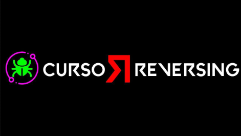
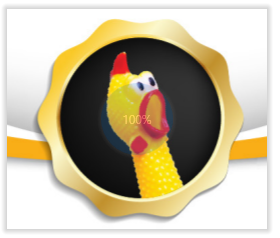

# Página de Ricardo Narvaja y Crackslatinos

- [NUEVO CURSO DE EXPLOITING Y REVERSING USANDO HERRAMIENTAS GRATUITAS (IDA FREE – RADARE – GHIDRA – WINDBG PREVIEW – X64DBG) EN CASTELLANO Y INGLES](http://ricardonarvaja.info/WEB/EXPLOITING%20Y%20REVERSING%20USANDO%20HERRAMIENTAS%20FREE/)
- [INTRODUCCION AL REVERSING CON IDA PRO DESDE CERO](http://ricardonarvaja.info/WEB/IDA%20DESDE%20CERO/)
- [VIDEO TUTES EN YOUTUBE](https://www.youtube.com/watch?v=viv-bdTpOpI&t=1s)
- [INTRODUCCION AL CRACKING CON OLLYDBG DESDE CERO](http://ricardonarvaja.info/WEB/INTRODUCCION%20AL%20CRACKING%20CON%20OLLYDBG%20DESDE%20CERO/)
- [CURSO DE C Y REVERSING](http://ricardonarvaja.info/WEB/C%20Y%20REVERSING/)

**NUEVO CURSO DE REVERSING Y CRACKING DESDE CERO EN YOUTUBE JUNTO A MI AMIGO SOLID.**
**ACTUALIZADO A WINDOWS 10**

**PUEDEN HALLARNOS EN TWITTER:**
- SOLID: [@Solid_cls](https://twitter.com/Solid_cls)
- RICNAR: [@ricnar456](https://twitter.com/ricnar456)

## Quién Soy

Me llamo Ricardo Narvaja y pertenezco a la lista de correo CRACKSLATINOS, los cuales somos un grupo de amigos a los cuales nos gusta enseñar, aprender y practicar el amado arte de la Ingeniería Inversa sin fines comerciales solo por curiosidad y ganas de compartir con amigos esta hermosa actividad desde el año 2000.

Queda claro que aquí no hay fin de lucro ninguno, solo enseñar, esto es practica lisa y llana, para aprender nuestro amado arte, no comercio.

Una mención especial para todos mis amigos de CRACKSLATINOS ellos no son solo amigos ya, si no que les debo la vida literalmente a ellos, ya saben porque lo digo, encabezados por mi amigo REDHAWK, el Comandante de la misma y todo nuestro ejército de amigos, tanto los avanzados como los newbies, mencionar uno a uno, sería interminable, son muchísimos y geniales todos, mi agradecimiento eterno para ellos, por acompañarme en los buenos momentos y ayudarme en los malos.

## CONTACTATE

Si quieres escribirnos con alguna duda sobre algún tutorial, allí está el mail.

> **ADVERTENCIA:** NO REALIZO CRACKS A PEDIDO, ni se molesten en escribirme para ello, solo ayudo al que veo que está intentando aprender y dándole algún tip, no solucionándolo yo, la idea es que el que aprende, practique busque e investigue por su cuenta si se traba y necesita alguna idea, pues en ese caso y demostrando que está trabajando en el tema, le daré alguna idea o camino a seguir, pero no realizo cracks a pedido, ni cobro por hacer cracks, ni nada de eso, así que no se molesten en escribir para pedir que les haga un crack de ninguna forma.

*Ricardo Narvaja*

## Enlaces

Links para acceder a la lista CRACKSLATINOS a la cual te podes suscribir es gratuito y no hay ninguna obligación, si tienes ganas de aprender, lo haces, si no tienes ganas pues jeje no haces nada, solo que recibirás los mails de la lista, pero bueno, siempre es lindo participar y si se puede colaborar mejor.

- [GRUPO CRACKSLATINOS EN GOOGLE GROUPS](https://groups.google.com/forum/#!forum/crackslatinos)
- [CRACKSLATINOS EN TELEGRAM](https://t.me/crackslatinos)
- [~~GRUPO ABIERTO DE CROWON EN TELEGRAM~~](https://t.me/joinchat/AJZkqhR-vkYQlavE1VGGKQ)

## Despedida

Bueno con este bonito fondo de pantalla de la lista CRACKSLATINOS que creo Juan Jose, por ahora nos despedimos sin más que agregar que disfruten los tutoriales y ojalá que aprendan a apreciar este hermoso arte como nosotros, que nada se pierde con intentar poniendo ganas y en CRACKSLATINOS somos muy pacientes con los que realmente tienen ganas de aprender y sus preguntas no molestan al contrario, nos encanta contestarlas.

**UN ABRAZO A TODOS MIS AMIGOS CRACKSLATINOS**

*Bye*

*Ricardo Narvaja*

---

*Backup by Apuromafo — 29/07/2026*
